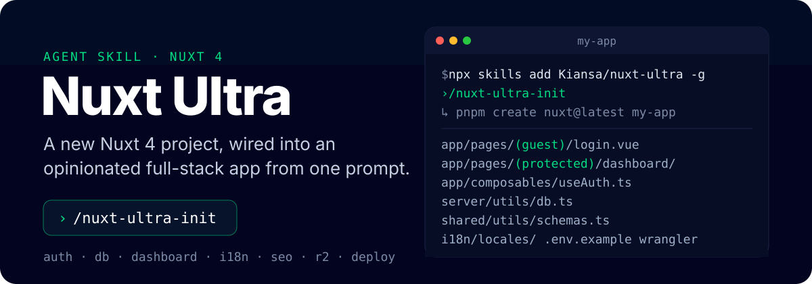
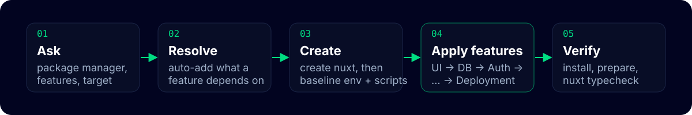

<p align="center">
  
</p>

Nuxt Ultra is not a template you clone. It is a [skill](https://skills.sh) for AI coding agents such as Claude Code, Cursor, Copilot and Codex. You install the skill once and ask the agent to run it. The agent asks which features you want, creates the project with `create nuxt`, resolves the dependencies between features, writes the files, installs packages and runs a typecheck.

Everything it generates is plain Nuxt code in your repository. There is no runtime dependency on this project and nothing to upgrade later.

## Quickstart

Install the skill once, globally:

```bash
npx skills add Kiansa/nuxt-ultra -g
```

Then, from the folder where the project should live, tell your agent:

```text
/nuxt-ultra-init
```

The agent asks the setup questions (project name, package manager, features, deployment target), runs `pnpm create nuxt@latest` with the minimal template, applies your selection and reports every file it created and every command it ran. "Init Nuxt Ultra" works as well if your agent has no slash commands.

> [!TIP]
> Run it inside an existing Nuxt project and the create step is skipped. Ask for "add Cloudflare R2 storage" or "add i18n" and only that feature's reference is applied.

## Features

Every group is optional. Pick what you need; dependencies are added automatically and explained to you.

| Group | Options |
|---|---|
| **UI** | [@nuxt/ui](https://ui.nuxt.com/) with a public shell (header, footer, home page) |
| **Linter** | [@nuxt/eslint](https://eslint.nuxt.com/) with fix-on-save editor settings |
| **Database** | [@nuxtjs/supabase](https://supabase.nuxtjs.org/), or `nuxt-postgrest`, a local module for any PostgREST endpoint with user-scoped JWTs for RLS |
| **Auth** | Supabase Auth, or [nuxt-auth-utils](https://github.com/atinux/nuxt-auth-utils) with password + email OTP, reset links, remember-me and GitHub/Google OAuth |
| **Dashboard** | User and/or admin dashboard built on Nuxt UI, at a route you choose or as the app root |
| **i18n** | [@nuxtjs/i18n](https://i18n.nuxtjs.org/) with file-based or database-backed translations and RTL support |
| **SEO** | [@nuxtjs/seo](https://nuxtseo.com/) with site config read from the environment |
| **Validation** | [zod](https://zod.dev/) schemas shared between forms and server routes |
| **AI** | Server-side clients for OpenAI, xAI, Gemini and Claude |
| **Storage** | Cloudflare R2 over the S3 API, with public and private upload endpoints |
| **Deployment** | Cloudflare Workers (with a bulk secrets script), Node or Vercel |

### Dependency rules

| If you select | You also get |
|---|---|
| Auth (either provider) | `@nuxt/ui` and `zod` |
| Auth via Supabase | Database via Supabase |
| Auth via `nuxt-auth-utils` | A database for the users table |
| Dashboard | `@nuxt/ui` and an Auth provider |
| i18n in remote mode | A database for translations |

> [!NOTE]
> `shadcn/nuxt`, `oxlint`, `prettier` and validation libraries other than zod are listed in the questions but not yet implemented. The agent will tell you and skip them.

## What the generated app looks like

The features share a small set of conventions so they compose cleanly:

- **Environment files.** `npm run dev` reads `.env.local` and `npm run build` reads `.env.production`. Both are gitignored; `.env.example` is the committed template and every feature appends its keys to it.
- **Route groups.** Signed-in pages live under `app/pages/(protected)/` and auth pages under `app/pages/(guest)/`. Nuxt exposes the folder names as `route.meta.groups`, which the auth middleware keys on. The folder never appears in the URL.
- **One auth composable.** `useAuth()` exposes `user`, `loggedIn`, `displayName`, `avatar` and `logout` regardless of the provider, so the dashboard works with either.
- **One database handle.** `useDb(event)` is the server-side admin client both database variants expose.
- **Thin server routes.** Handlers validate with `readValidatedBody(event, schema.parse)` using schemas from `shared/utils/`, then call a helper from `server/utils/`.
- **Generated types.** `shared/types/database.types.ts` is produced by `npm run db:types` through the Supabase CLI for either database variant.
- **Bundled icons.** Icons come from `@iconify-json/*` packages, so nothing is fetched at runtime on edge hosts.

## How it works

<p align="center">
  
</p>

The skill is a `SKILL.md` plus one reference file per feature:

```
skills/nuxt-ultra-init/
├── SKILL.md                 questions, create step, dependency rules, apply order, verification
└── references/
    ├── baseline.md          normalises the created project (always applied)
    ├── feature-ui.md
    ├── feature-nuxt-eslint.md
    ├── feature-db.md
    ├── feature-auth-supabase.md
    ├── feature-auth-nuxt-auth-utils.md
    ├── feature-dashboard.md
    ├── feature-i18n.md
    ├── feature-seo.md
    ├── feature-validation.md
    ├── feature-ai.md
    ├── feature-storage.md
    └── feature-deployment.md
```

Each reference is a sequence of `### Path: <file>` blocks the agent creates, or patches minimally if the file exists, and `### Path: terminal command` blocks it runs with your package manager. Features are applied in a fixed order (UI, Linter, DB, Auth, Dashboard, i18n, SEO, Validation, AI, Storage, Deployment) and `nuxt.config.ts` is written once with every feature's additions merged.

The agent follows a few guardrails: it preserves unrelated changes, keeps runs idempotent, never writes secrets into files and never pins package versions. After installing it runs `nuxt prepare` and `nuxt typecheck` (plus `lint` when ESLint was selected) and fixes anything the setup broke.

> [!IMPORTANT]
> Pair this skill with the official [`nuxt`](https://skills.sh) and [`nuxt-ui`](https://ui.nuxt.com/docs/getting-started/ai/skills) skills. Nuxt Ultra scaffolds the app; those give your agent framework and component guidance while you build on it.

## Developing the skill

There is no build and nothing to run in this repository. To verify a change to a reference:

1. In a scratch directory, install the skill from your checkout with `npx skills add ./skills/nuxt-ultra-init`, or copy it into `.agents/skills/`.
2. Run `/nuxt-ultra-init` there with the affected feature selected.
3. Make sure `nuxt typecheck` passes in the created project.
